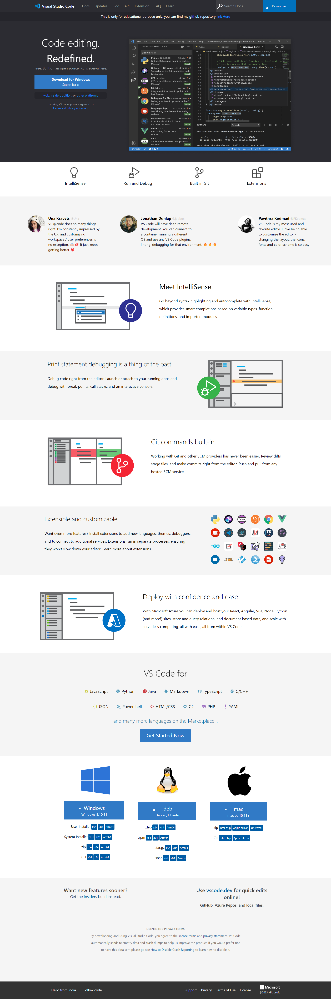

# VS Code Website Clone

This is a clone of the official website of Visual Studio Code, created using Tailwind CSS. The project aims to replicate the design and functionality of the VS Code website.

## Preview

## Features

- Responsive design using Tailwind CSS.
- Navigation menu with smooth scrolling.
- Sections for showcasing features, testimonials, and pricing.
- Contact form for users to get in touch.
- Footer with social media links and other relevant information.

